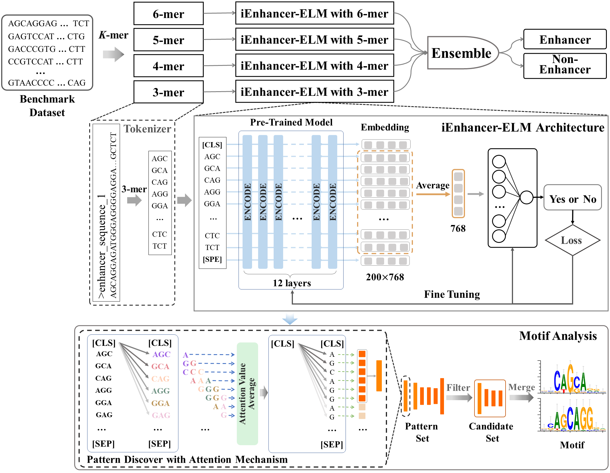

# iEnhancer-ELM
📋 iEnhancer-ELM: Learning Explainable Contextual Information to Improve Enhancer Identification using Enhancer Language Models

## Abstract
&nbsp;&nbsp;&nbsp;&nbsp; Enhancers are important cis-regulatory elements that regulate a wide range of biological functions and enhance the transcription of target genes. In order to efficiently identify enhancers, many state-of-the-art computational methods have been proposed. One of challenges for computational methods is learning effective long-distance contextual features. Recently, several works took the biological sequences as natural sentences and employed the language model techniques from natural language processing to capture the long-distance contextual information.

&nbsp;&nbsp;&nbsp;&nbsp; In this paper, we propose an enhancer language model **(iEnhancer-ELM)** for enhancer identification by incorporating a pre-trained BERT-based DNA model. iEnhancer-ELM treats enhancer sequences as natural sentences that are composed of k-mer nucleic acids to extract informative biological features from raw enhancer sequences. Benefiting from the complementary information in various k-mer (k=3,4,5,6) tokens, we ensemble four iEnhancer-ELM models for improving enhancer identification. The experimental results show that our model achieve an accuracy of **83.00%**, outperforming competing state-of-the-art methods. Moreover, **40%** of motifs found by iEnhancer-ELM can exhibit statistical and biological significance, demonstrating our model is explainable and has a potential ability to reveal the biological mechanism. 

## Contribution
&nbsp;&nbsp;&nbsp;&nbsp; Experiments on the benchmark dataset shows **iEnhancer-ELM with various k-mers achieves an accuracy of about **80%, outperforming all kind of well-known models with single feature**. We ensemble multiple iEnhancer-ELM models based on various k-mer tokens to achieve a better performance with accuracy of **83.00%**, outperforming existing state-of-the-art methods. Furthermore, we interpret the actions of iEnhancer-ELM by analyzing the patterns in attention mechanism. **We find the motifs extracted from the attention mechanism match existing motifs with significant level**, demonstrating the ability of iEnhancer-ELM capturing important biological features for enhancer identification. The contribution of this work can be summarized as follows: 
* We propose the enhancer language models by incorporating a pre-trained BERT-based DNA model to capture global contextual information from raw enhancer sequences. 
* Our iEnhancer-ELM achieves the best performance comparing with well-known models based on single feature, and the ensemble iEnhancer-ELM outperforms existing state-of-the-art methods. 
* iEnhancer-ELM has the ability to capture important biological motifs for enhancer identification, demonstrating its potentials for revealing the biological mechanism of enhancers.

## Model Structure
&nbsp;&nbsp;&nbsp;&nbsp; The following figure is the illustration of our proposed method. The top subfigure is the flowchart of enhancer identification, and the below subfigure is our motif analysis via the attention mechanism in iEnhancer-ELM with 3-mer. 

## Result
### Performance comparison in the independent dataset

between ensemble iEnhancer-ELM and the state-of-the-art predictors for enhancer indefication
| Method          | Acc    | Sn     |Sn     |MCC   |
| iEnhancer-2L    | 0.7300 | 0.7100 | 0.7500 | 0.4600 |
| iEnhancer-EL    | 0.7475 | 0.7100 | 0.7850 | 0.4960 |

                \textbf{Method} & \textbf{Acc} & \textbf{Sn} & \textbf{Sn} & \textbf{MCC}\\ 
                  \hline
                    iEnhancer-2L          & 0.7300 & 0.7100 & 0.7500 & 0.4600  \\
                    iEnhancer-EL          & 0.7475 & 0.7100 & 0.7850 & 0.4960  \\      
                    iEnhancer-XG          & 0.7575 & 0.7400 & 0.7750 & 0.5140 \\
                    iEnhancer-Deep        & 0.7402 & 0.8150 & 0.6700 & 0.4902 \\
                    iEnhancer-GAN         & 0.7840 & 0.8110 & 0.7580 & 0.5670 \\
                    iEnhancer-5Step       & 0.7900 & \textbf{0.8200} & 0.7600 & 0.5800 \\
                    BERT-Enhancer         & 0.7560 & 0.8000 & 0.7750 & 0.5150  \\
                    iEnhancer-ELM  & \textbf{0.8300} & 0.8000 & \textbf{0.8600} & \textbf{0.6612} \\
                \hline

## Code
We add the analysis codes to this folder. In the motif analysis, we refer to codes from [Ji et al.](https://academic.oup.com/bioinformatics/article-abstract/37/15/2112/6128680). We add the result of motif analysis in the folder of 'atten'. The folder of 'analysis' contains the t-SNE analysis process of sequence embedding.

In addition, the pre-trianed BERT-based DNA model is from [Ji et al.](https://academic.oup.com/bioinformatics/article-abstract/37/15/2112/6128680). In practice, we attach a 2-layer perceptron network as the classifier followed the pre-trained model and then fine-tune these pre-trianed weights on our enhancer benchmark dataset. We can download the pre-trained models and their corresponding iEnhancer-ELM models in this [link_of_models](https://drive.google.com/drive/folders/10Gr9RzB_tZGosA-aSwWHB3pB68AvNk5_?usp=sharing). 
